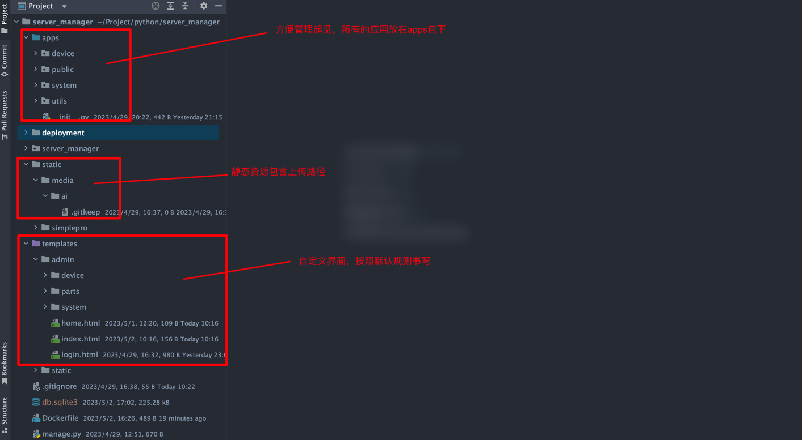
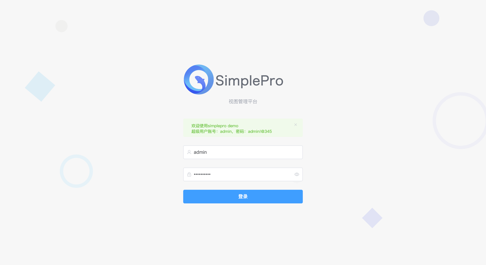
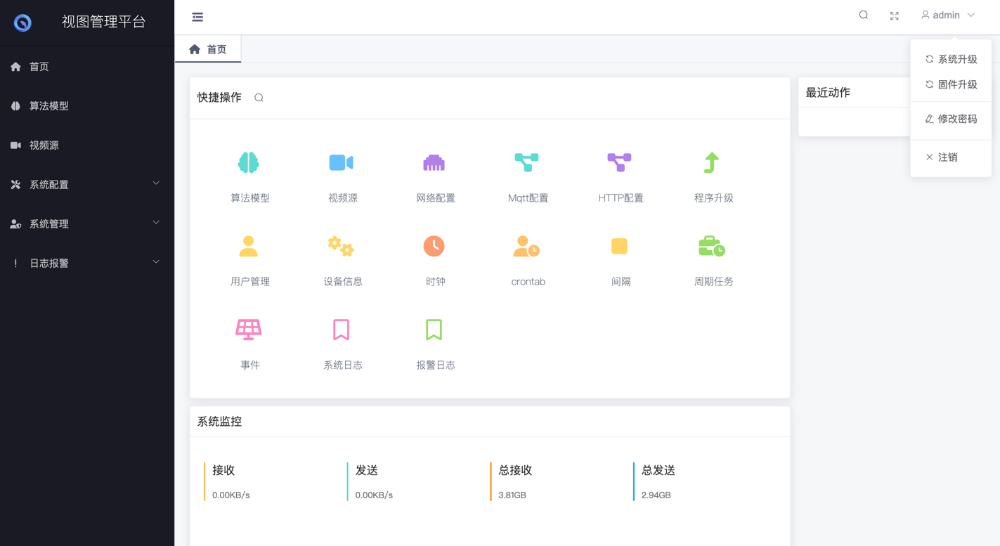
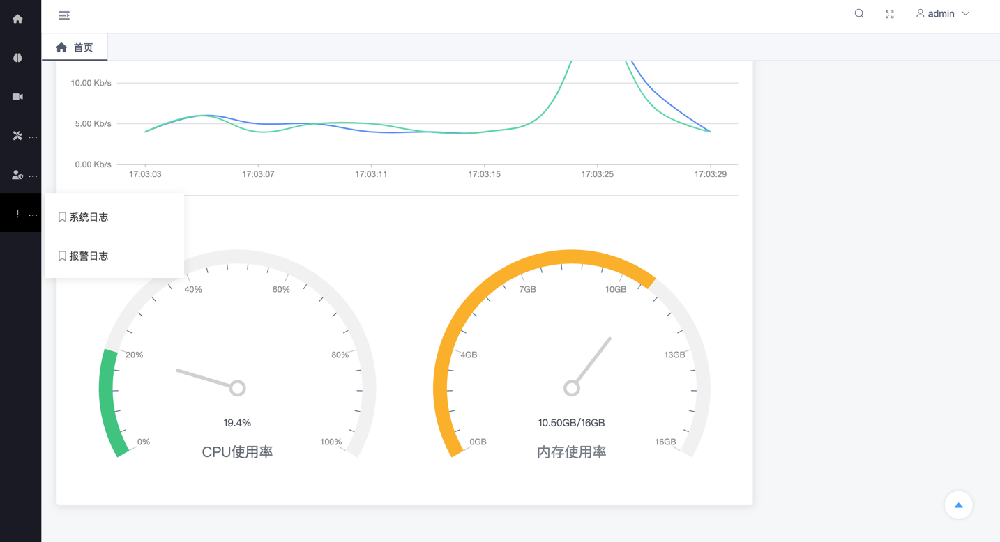
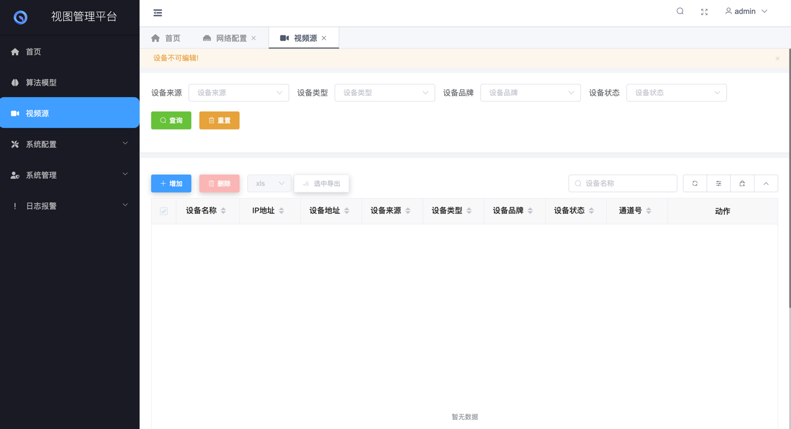
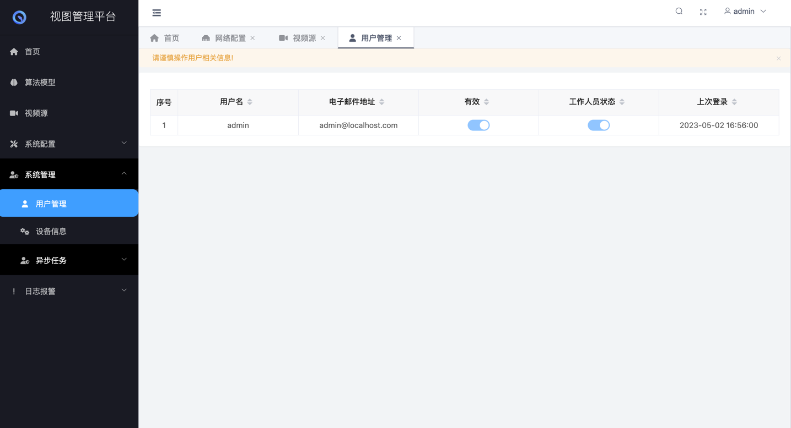
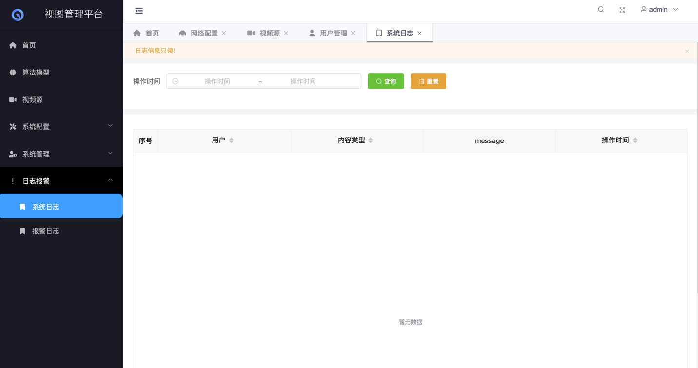
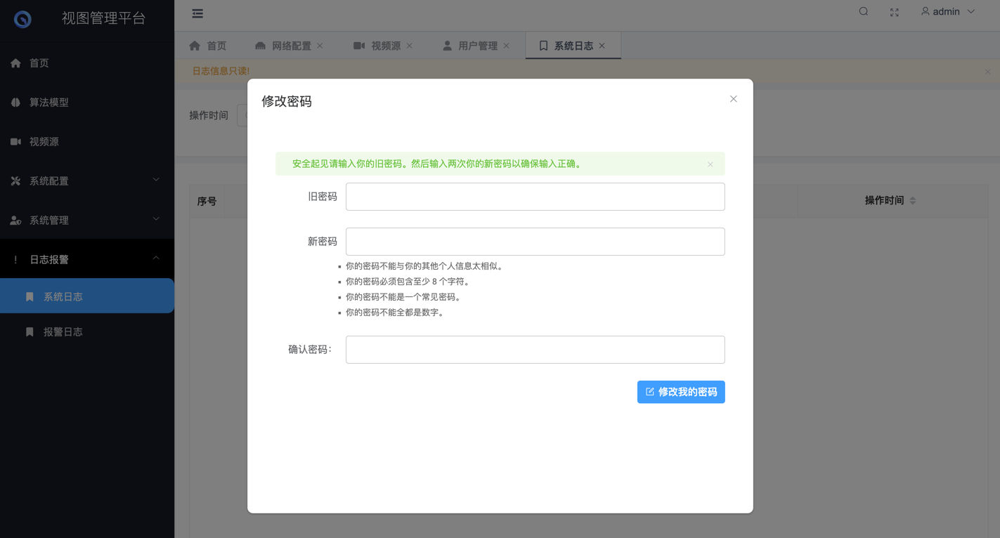

## 一体机后台

> 基于simplepro开发,所有页面均可自定义,只需要Django基础跟vue基础。按照默认的写法进行简单的配置，数据返回为restful风格的json数据

```text
为了系统更加轻量级，数据库采用默认的sqlite3实现；
去除了默认的celery周期任务，周期任务采用apscheduler实现
```

#### 一些自定义指令

```shell
python manage.py migrate  # 数据库迁移
python manage.py user_init  # 用户初始化
python manage.py network_init  # 网络初始化
python manage.py scheduler  # 周期任务
python manage.py runserver 0.0.0.0:8000  # 系统运行
```

---

#### 效果图

##### 目录结构



##### 登录页



##### 首页




##### 设备页



##### 用户页



##### 日志页



##### 修改密码


